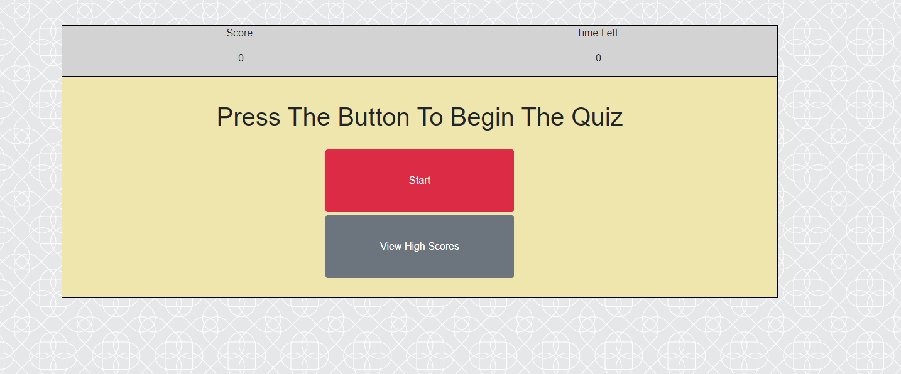
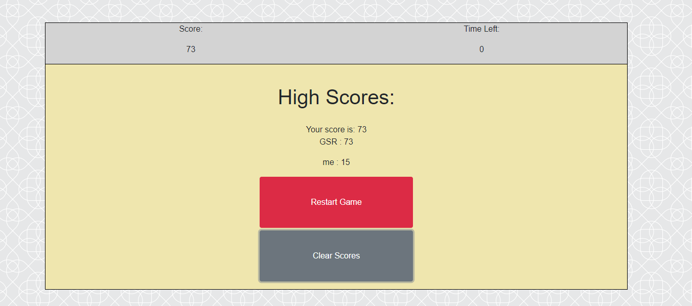

# coding-quiz
https://greichman.github.io/coding-quiz/  
By: Garrett Reichman

## Description
    This project is a coding quiz made to build my experience with jquery and DOM manipulation. It allows the user to complete a short quiz while being timed and displays their score once they have either finished the questions or run out of time. It then stores their score in a list of high scores for later reference.

## Usage
    To begin, either click the Start button to begin the quiz or the View High Scores button to view the current scores recorded in local storage.  
    
    
     
    Once the quiz begins, you will have roughtly 15 seconds per question to answer all 5 questions (given in a random order). If you answer incorrectly, you will lose 15 seconds and continue to the next question. If you answer correctly, you will gain 1 point by default, and 1 bonus point for every second less than 15 seconds it took you to answer the question. Once the game ends, you will have the option of viewing high scores, and restarting the game.   

    